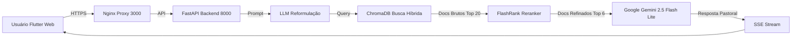

# Scripture AI Assistant 🛡️📖

> **MBA USP/Esalq - TCC**
> **(Engenharia de Software)**
> **(2026)**
> 
> *Agente Conversacional Teológico em Arquitetura RAG: Mitigação de Alucinações e Democratização do Ensino Bíblico*

Este projeto implementa um **Assistente Teológico Inteligente** capaz de responder dúvidas doutrinárias, exegéticas e bíblicas com alta precisão, fidelidade teológica e tom pastoral ("Persona"). Diferente de interfaces de IA genéricas, o agente opera sob o princípio *Sola Scriptura* e auditoria RAG, utilizando estritamente documentos e obras teológicas curadas como fonte de verdade, mitigando o risco de "alucinações" em contextos sensíveis.

## 📚 Base de Conhecimento (Corpus Teológico)
Para garantir a integridade doutrinária e respeitar as leis de direitos autorais, o índice vetorial (*Vector Store*) deste protótipo foi alimentado exclusivamente com obras de domínio público da tradição cristã protestante histórica, incluindo:
* **Bíblia Sagrada**: Tradução João Ferreira de Almeida Corrigida Fiel (ACF) e equivalentes em domínio público.
* **Teologia Histórica e Sistemática**: Obras clássicas de domínio público (ex: *Institutas da Religião Cristã* de João Calvino).
* **Documentos Confessionais**: Confissão de Fé de Westminster e Catecismos históricos.

## ✨ Diferenciais Acadêmicos e Técnicos
* **🧠 Arquitetura RAG com Reranking**: Utiliza **FlashRank** para refinar a busca vetorial no ChromaDB, garantindo que apenas os fragmentos semanticamente mais relevantes sejam injetados no contexto do modelo (*Precision@K* otimizado).
* **📐 Alta Dimensionalidade Semântica**: Vetorização de documentos realizada com o modelo de ponta **`text-embedding-004`** da Google, gerando representações matemáticas de **768 dimensões** para capturar nuances exegéticas profundas.
* **📊 Validação por LLM-as-a-Judge**: Artefato validado pelo *framework* **RAGAS** (*Retrieval Augmented Generation Assessment*), convertendo conceitos qualitativos de teologia em métricas auditáveis (Fidelidade e Relevância).
* **🔗 Citações Interativas**: Interface multiplataforma (*Flutter*) com sistema de *Deep Linking* para referências.
* **🐳 100% Dockerized**: Ambiente *Cloud-Native* isolado (Python/FastAPI no Backend e Flutter Web/Nginx no Frontend) garantindo paridade total de execução e reprodutibilidade científica.

## 🏆 Resultados Obtidos (Validação Científica)
Os testes de estresse doutrinário comprovaram empiricamente que a arquitetura RAG desenvolvida soluciona o problema de "alucinações" inerente aos Modelos de Linguagem Genéricos (Baseline), elevando a segurança da informação para níveis de exigência pastoral.

| Métrica (RAGAS) | Modelo Genérico (Baseline) | Agente RAG (Proposto) | Ganho |
| :--- | :--- | :--- | :--- |
| **Fidelidade às Fontes (*Faithfulness*)** | 0.60 | **0.89** | **+48%** |
| **Relevância da Resposta (*Answer Relevancy*)** | 0.68 | **0.71** | +4% |
| **Precisão de Contexto (*Context Precision*)** | 0.00 | **0.23** | +23% |
| **Latência Média** | 3.89s | **11.19s** | *Trade-off aceitável* |

### 📂 Evidências e Relatórios de Auditoria
A transparência dos dados experimentais é um pilar desta pesquisa. Os relatórios brutos (*logs*) contendo a avaliação do *framework* RAGAS para as 15 questões de estresse estão disponíveis no diretório `/results`:
* 📄 [Relatório Final do Agente RAG](./results/agent_report.md)
* 📄 [Relatório do Modelo de Controle (Baseline)](./results/baseline_report.md)
* 📊 [Dados Brutos Consolidados (CSV)](./results/results.csv)

## 🏗️ Arquitetura Lógica



## 🚀 Como Executar (Reprodutibilidade)

Pré-requisitos: [Docker Desktop](https://www.docker.com/products/docker-desktop) instalado e uma chave de API do [Google AI Studio](https://aistudio.google.com/).

### 1. Configuração do Ambiente
Clone o repositório e configure as variáveis de ambiente:
```bash
cp .env.example .env
# Edite o arquivo .env inserindo sua GOOGLE_API_KEY e se preferir, ajuste o GOOGLE_MODEL_NAME (Padrão: gemini-2.5-flash-lite) e os outros parametros opcionais.
```

### 2. Orquestração de Contêineres
Utilize os *scripts* automatizados para levantar o ambiente completo (Backend, Frontend e Banco Vetorial) sem a necessidade de comandos complexos do Docker:
```bash
# Iniciar todos os serviços
./scripts/start_app.sh

# Monitorar logs em tempo real
./scripts/view_logs.sh

# Encerrar a aplicação
./scripts/stop_app.sh
```
* **Frontend Web**: Acesse `http://localhost:3000` 🌐
* **API Backend (Swagger UI)**: Acesse `http://localhost:8001/docs` ⚙️

### 3. Ingestão de Conhecimento Automatizada
Antes de realizar testes generativos, é imperativo povoar o banco de dados vetorial (ChromaDB) com o referencial teológico para que a arquitetura RAG possua *grounding*. 

1. **Pipeline Automático**:
   Execute o script mestre que fará o *download* da Bíblia (via API), a sanitização de *PDFs* e o processamento de *chunking* recursivo:
   ```bash
   ./scripts/train.sh
   ```
2. **Ingestão Manual Adicional**:
   Para expandir o conhecimento, aloque arquivos acadêmicos (`.pdf`, `.epub`, `.txt`) no diretório local `source_docs/` e reexecute o comando `./scripts/train.sh`. 

### 4. Execução do Experimento ("One-Click Thesis")
Para reproduzir os testes automatizados da tese de ponta a ponta e re-gerar os relatórios comparativos do RAGAS:
```bash
./scripts/run_full_experiment.sh
```

Isso gerará 4 artefatos em `evaluation/`:
1.  `agent_report.md`: Resultados do Sistema Proposto.
2.  `baseline_report.md`: Resultados da Linha de Base.
3.  `ablation_report.md`: Justificativa Arquitetural.
4.  `results.csv`: Dados brutos com latência e métricas RAGAS.

> *Nota Técnica: A execução integral demanda aproximadamente 45 minutos em virtude das limitações de requisição (Rate Limits) da camada gratuita da API do Gemini.*

## 🛠️ Stack Tecnológica Central
* **IA Generativa**: Google Gemini 2.5 Flash Lite (Temperatura: 0.3)
* **Modelo de Embeddings**: Google `text-embedding-004` (768 dimensões)
* **Banco de Dados Vetorial**: ChromaDB (Busca por Similaridade de Cosseno)
* **Orquestração RAG**: LangChain
* **Reranker Semântico**: FlashRank (Execução On-CPU)
* **Servidor de Aplicação**: Python 3.12 via FastAPI (Padrão ASGI)
* **Interface**: Flutter 3.x (Código-base único)

## 📄 Licença
Artefato de software acadêmico desenvolvido sob os preceitos de Ciência Aberta (*Open Science*) para fins de pesquisa e Trabalho de Conclusão de Curso (MBA USP/Esalq).

---
Desenvolvido por [Luis Henrique Bruneri](https://github.com/luishbruneri) 🇧🇷